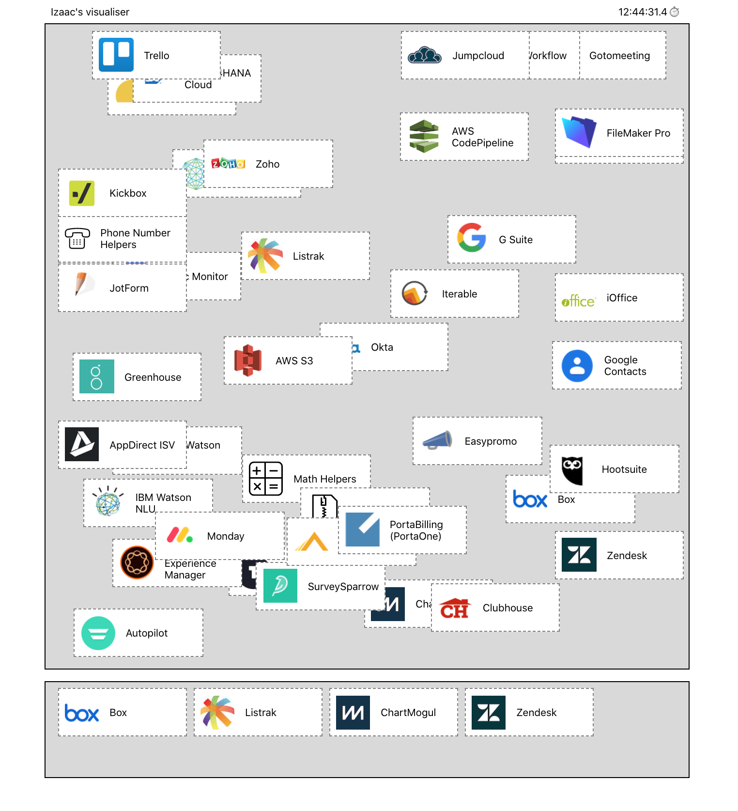

Tray.io
------

*This took more like 6 hours, but I was enjoying it.*

It should deliver to the spec. I used TypeScript as the job advert is for a senior TypeScript developer. There are some data manipulations which make it very useful here anyway.

Other libraries I used include date-fns for their format function, react-dnd for all of the dragging parts and `styled-components` for the styling. I use `prettier` and `eslint` to keep everything tidy, `jest` and `react-testing-library` to write tests.

---
#### How to run

I built this on `create-react-app` so to run a `yarn install` then a run `yarn start`. Alternatively do a `yarn install && yarn build && cd build && npx http-server .` to run it in production mode.

---
#### Notes
I called the data received from your api "events" as this would allow us to set a type to determine if its specifically a connector, a notification, or something else later on.
Best entry point is `./src/pages/home`

---
#### About me

I'm Izaac Broadbent - a full stack developer with about 10 years experience. I'm a typescript specialist, and have done many frontend roles in Angular and React.

My CV is a available here: https://drive.google.com/file/d/1ewpN2S5RZJKrsP3s9u4z_QW8hU_46cEx/view?usp=sharing
